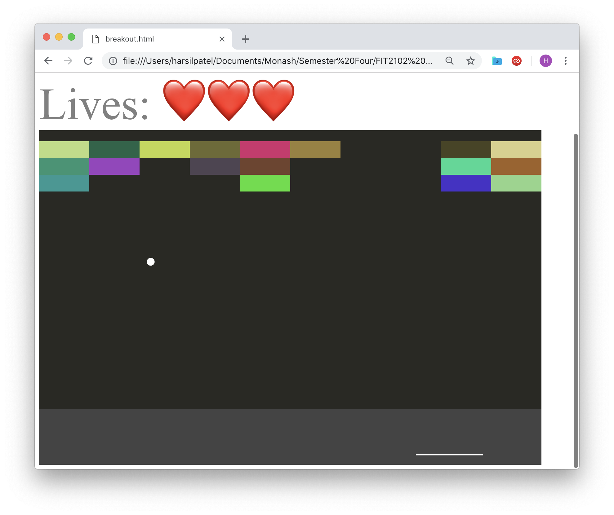

# pong-breakout

Created pong and breakout games employing the [Observer pattern](https://en.wikipedia.org/wiki/Observer_pattern) and abiding by paradigms of [functional programming](https://en.wikipedia.org/wiki/Functional_programming).

Try it out here: https://harsilspatel.github.io/pong-breakout/

## Screenshots 📸

 

 

## Credits 👏🏻
Assignment base by [Professor Tim Dwyer](https://github.com/tgdwyer)

Props to [Drs. Arthur Maheo](http://arthur.maheo.net/) for being my tutor. If it weren't for your guidance and strictness I wouldn't have had worked as hard or learnt as much. Thank you Arthur! :D

Thank you [Yang Liew](http://www.dyliew.com/) for all your patience and for staying back even after the late night consultations to help me out. It was a tough semester, but you got me though it! :D

## Related 🎮
You may like [ohHell](https://github.com/harsilspatel/ohHell), a trick-taking card game in which the objective is to win exactly the number of tricks bid 🃏

P.S. had nailed the assignment. 💯
